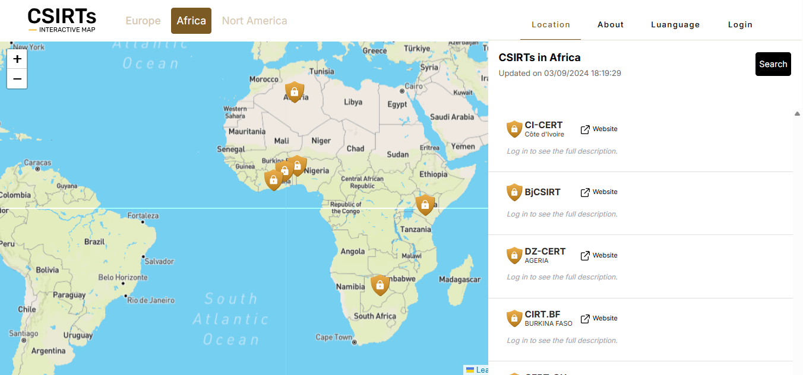
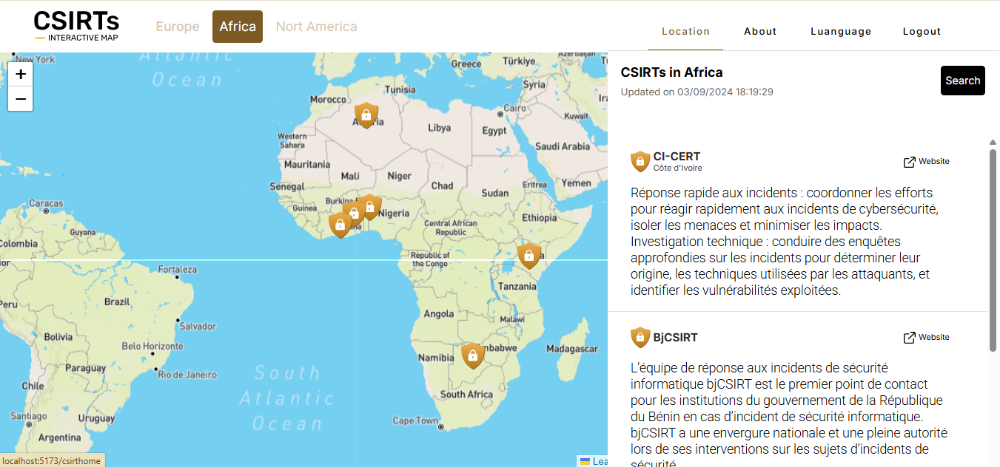
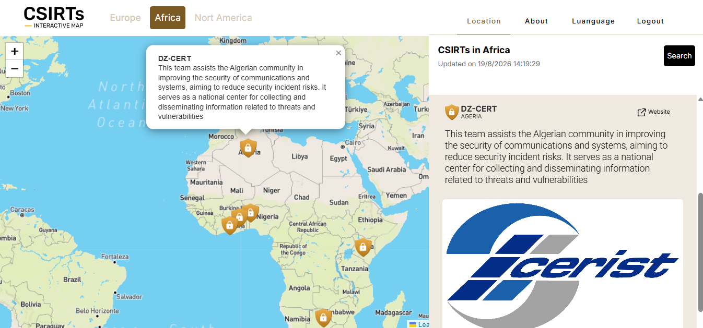
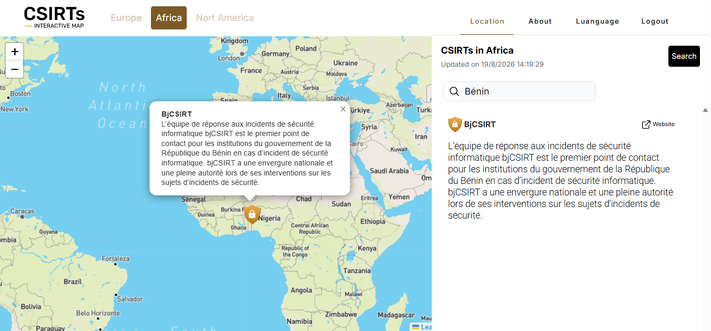
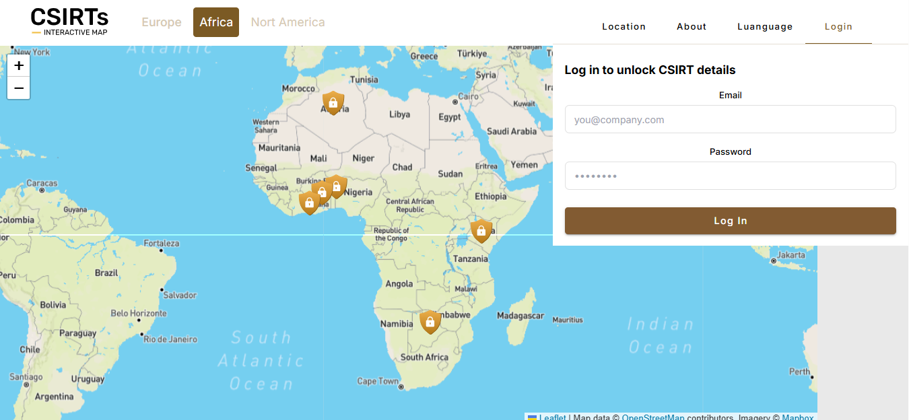

# CSIRT Africa — Frontend

Interactive map of **Computer Security Incident Response Teams (CSIRTs)** operating on the African continent. Users explore the CSIRTs by clicking pins on a Leaflet map, filter the list with a search bar, and unlock full descriptions and logos with a lightweight inline login.

Companion backend repo: **[csirts-app-api](https://github.com/Tchobo/csirts-app-api)** — Django REST Framework + PostgreSQL + Docker.

---

## Screenshots

### Guest experience — map + teaser list
Guests immediately see the interactive map and every pin, but each CSIRT card shows only its name, country and website. A short "Log in to see the full description" placeholder pushes the visitor toward the Login tab.



### Logged-in experience — full descriptions unlocked
Once authenticated, the same list renders each CSIRT's full description in place. The tab label flips from **Login** to **Logout**, no page reload needed.



### Marker click → auto-scroll + panel opens
Clicking a marker opens its popup on the map **and** scrolls the right-hand list to the matching card, which auto-expands to reveal the CSIRT logo/image.



### Live search across map and list
Typing in the search bar filters both the list and the map markers in real time — no submit button, no reload.



### Inline login (in-tab)
The Login tab embeds the auth form directly — the user stays on the map, keeps context, and never leaves the page during login.



---

## Features

- **Interactive Africa map** built on Leaflet + Mapbox tiles, with a custom shield icon per CSIRT and a popup showing name (guest) or name + description (authenticated).
- **Guest mode** — the map, marker pins, CSIRT names, countries and website links are public. Descriptions and logos are gated behind login.
- **Inline login / logout tab** — no separate page transition, no lost context; the tab label toggles based on session state.
- **Live search** — case-insensitive substring match across name, country, website, and description; filters both the list and the map markers together.
- **Marker → list sync** — clicking a marker scrolls the list to its card, expands the panel and (once logged in) reveals the logo.
- **Auto-refetch on login** — the CSIRT list is refetched after a successful sign-in so authenticated data replaces the anonymous payload.
- **Persistent session** — the token lives in `localStorage` and the Vuex store hydrates from it on every mount, so a browser refresh keeps the user signed in.

---

## Tech stack

| Layer              | Tooling                                                        |
|--------------------|----------------------------------------------------------------|
| Framework          | Vue 3 (Composition API, `<script setup>`)                      |
| Build              | Vite 5                                                         |
| UI kit             | Vuetify 3                                                      |
| Utility CSS        | Tailwind CSS 3                                                 |
| State              | Vuex 4                                                         |
| Routing            | Vue Router 4                                                   |
| HTTP               | Axios                                                          |
| Map & tiles        | Leaflet 1.9 + Mapbox Streets style                             |
| Icons              | FontAwesome, Vue Material Design Icons, Heroicons              |
| Deployment target  | Netlify (static SPA build, `_redirects` for history routing)   |

---

## Getting started

### Prerequisites

- **Node.js ≥ 18**
- The backend running locally on `http://localhost:8000` (see [csirts-app-api README](https://github.com/Tchobo/csirts-app-api)).

### Install & run

```bash
git clone https://github.com/Tchobo/csirt-app-front.git
cd csirt-app-front
npm install
npm run dev
```

Open [http://localhost:5173](http://localhost:5173) — you'll land directly on the map in guest mode.

### Environment variables

Both `.env` (local) and `.env.production` (build-time) expose two variables:

```bash
# Backend API URL — swap for staging / prod as needed.
VITE_API_URL=http://localhost:8000

# Mapbox access token — pk.* (public) type. Restrict the token to your
# frontend domain(s) in the Mapbox dashboard so a leak stays harmless.
VITE_MAPBOX_TOKEN=pk.xxxxxxxxxxxxxxxxxxxxxxxxxxxx
```

For a hosted backend, set `VITE_API_URL` to the deployed API URL (e.g. `https://csirts-app-api.onrender.com`). Grab a Mapbox token from [account.mapbox.com/access-tokens](https://account.mapbox.com/access-tokens/) — the free tier is generous enough for this project.

### Build for production

```bash
npm run build     # emits dist/
npm run preview   # serves the built bundle locally
```

---

## Project structure

```
src/
├── assets/            # images, illustrations, custom marker icons
├── components/        # reusable pieces (Header, Modal, SearchForm, Hero…)
├── helpers/           # api-call.js — axios wrapper reading VITE_API_URL
├── router/            # Vue Router — / redirects to /csirthome (public home)
├── store/             # Vuex — csirtList, userToken, actions, mutations
└── views/
    ├── Welcome.vue    # main map + tabs (Location, About, Language, Login/Logout)
    └── Login.vue      # standalone login page kept for deep links
```

Notable design decisions:

- **`/` redirects to `/csirthome`** — the home is the map. The auth guard was removed on purpose since guest mode is a first-class experience; keeping it would have created an infinite redirect loop.
- **Login is embedded in a tab, not a separate route** — the standalone `Login.vue` view is kept as a fallback for direct navigation (bookmarks, deep links), but the primary auth flow lives inside `Welcome.vue`'s Login tab.
- **Auth state is a `computed` on `store.state.userToken`** — the tab label, gated content, and marker popup HTML all react automatically when the token appears or disappears.

---

## Contributing

1. Fork the repo.
2. Create a feature branch: `git checkout -b feat/short-name`.
3. Commit with **Conventional Commits** (`feat(scope): …`, `fix(scope): …`).
4. Push and open a PR against `main` with a clear description and screenshots for UI changes.

---

## License

MIT.
